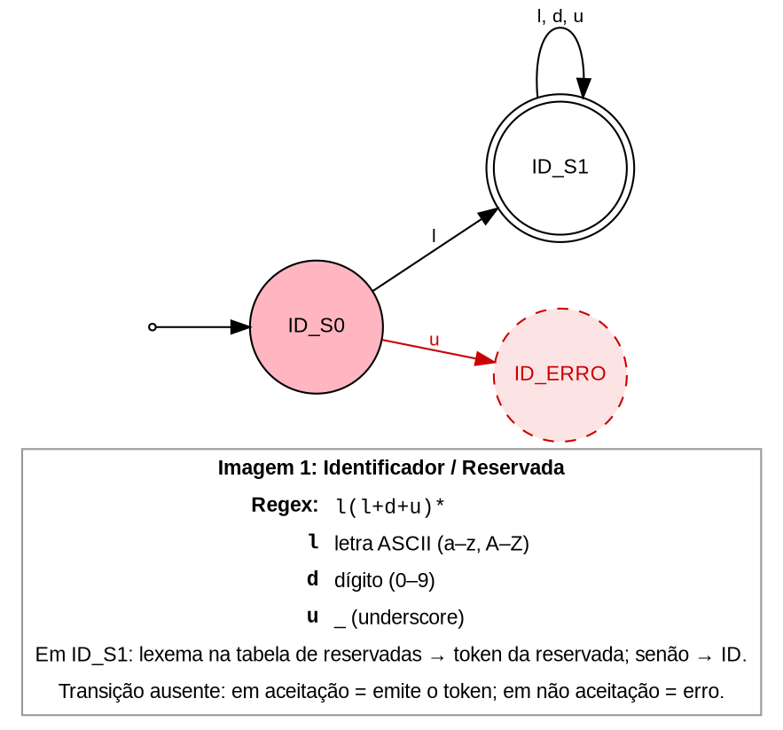
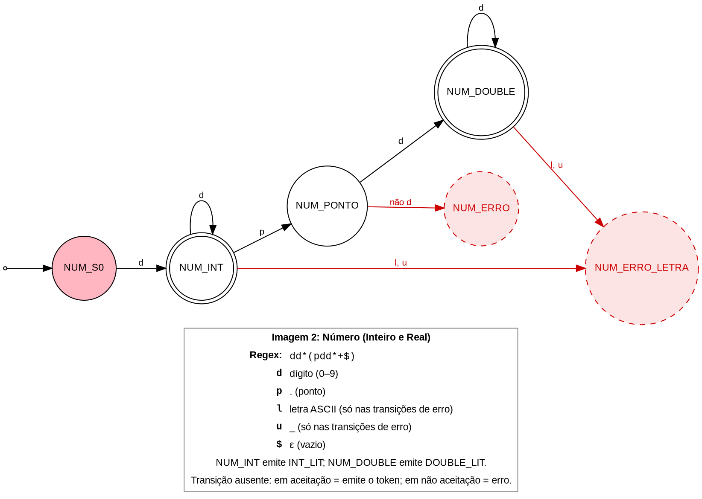
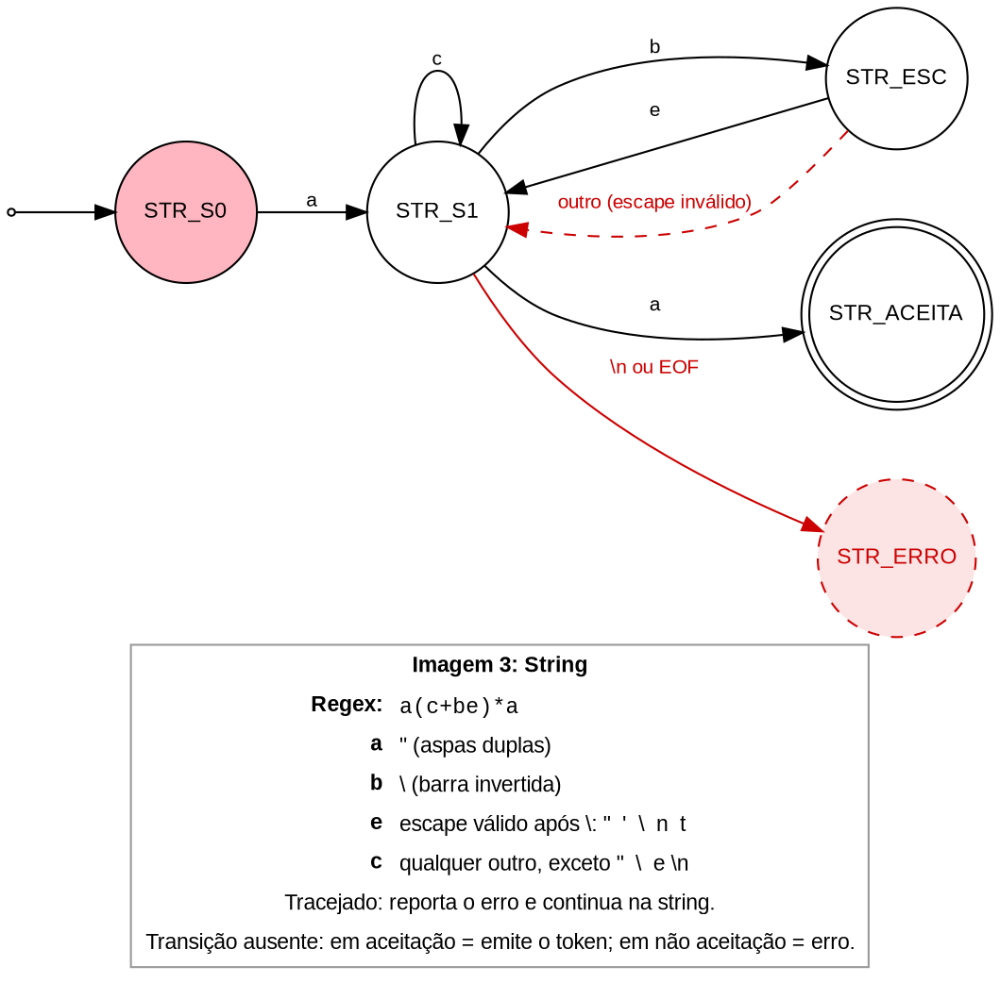
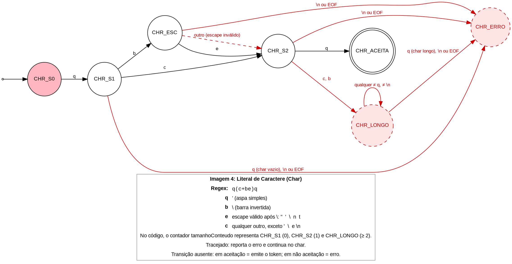
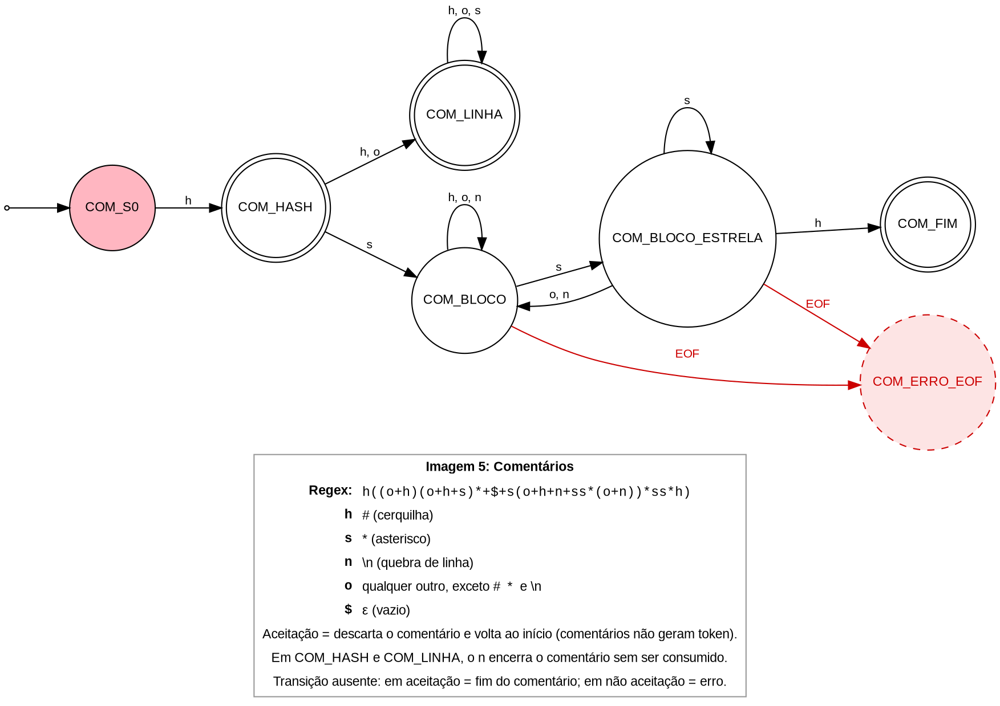

# Autômatos Finitos Determinísticos (AFD) - Scanner

Esta pasta contém as especificações, tabelas de mapeamento com o código `Scanner.java` e os diagramas visuais dos cinco Autômatos Finitos Determinísticos (AFDs) do analisador léxico.

---

## Convenção Geral

Geramos os autômatos usando do site FSM Simulator (https://ivanzuzak.info/noam/webapps/fsm_simulator), que recebe expressões regulares e as transforma em representações visuais de seu autômato. A partir das representações geradas, usamos IA para atribuir nomes aos estados, acrescentar legenda e atribuir melhorias.

Os autômatos gerados via site geravam um estado "lixo" para receber transições não definidas. No `Scanner.java`, o estado lixo possui dois significados:

- **Saindo de um estado de aceitação**: Não é erro. É o *maximal munch* terminando (o scanner para, emite o token e não consome o caractere).
- **Saindo de um estado de não aceitação**: É erro léxico.

### Regra de Legenda
O estado lixo foi apagado de todos os desenhos:
> **"Transição ausente em estado de aceitação = emite o token; em estado de não aceitação = erro."**

Os erros com tratamento específico no código foram desenhados explicitamente em cada autômato.

---

## Imagem 1: Identificador / Reservada

| Nome | Significado | Código |
|:---:|:---|:---|
| `ID_S0` | início | `if (ehLetra(c))`, linha 183 |
| `ID_S1` | aceita: ID ou reservada | laço da linha 231; a consulta à tabela está na linha 236 |

- dígito e _ não pertencem a este autômato: o dígito desvia para o AFD de número, e o _ gera o erro ID_ERRO (`linha 219`).
- **Anotação em `ID_S1`**: *"lexema na tabela de reservadas → token da reservada; senão → ID"*.

---

## Imagem 2: Número

| Nome | Significado | Código |
|:---:|:---|:---|
| `NUM_S0` | início | `ehDigito(c)`, linha 185 |
| `NUM_INT` | aceita: INT_LIT | laço da linha 241 |
| `NUM_PONTO` | leu o `.`, espera dígito | linhas 247 e 248 |
| `NUM_DOUBLE` | aceita: DOUBLE_LIT | laço da linha 254 |

- Erro de `NUM_PONTO`: *"não dígito → NUM_ERRO"* (linha 251, *"Real sem dígito após o ponto"*).
- Erro de Número + Letra: *"letra ou _ → NUM_ERRO_LETRA"* a partir de `NUM_INT` e `NUM_DOUBLE` (linha 261).

---

## Imagem 3: String

| Nome | Significado | Código |
|:---:|:---|:---|
| `STR_S0` | início | `case '"'`, linha 189 |
| `STR_S1` | dentro da string | laço da linha 276 |
| `STR_ESC` | leu `\` | linha 277 |
| `STR_ACEITA` | aceita: STRING_LIT | linha 299 |

- `STR_ESC` com *"outro caractere"* → volta para `STR_S1` com a nota *"reporta escape inválido"* (linha 283: reporta o erro e continua na string).
- `STR_S1` com `\n` ou `EOF` → `STR_ERRO` (linhas 291 e 295).

---

## Imagem 4: Char

| Nome | Significado | Código |
|:---:|:---|:---|
| `CHR_S0` | início | `case '\''`, linha 190 |
| `CHR_S1` | leu `'`, espera o conteúdo | `tamanhoConteudo == 0` |
| `CHR_ESC` | leu `\` | linha 308 |
| `CHR_S2` | um caractere lido, espera `'` | `tamanhoConteudo == 1` |
| `CHR_ACEITA` | aceita: CHAR_LIT | linhas 336 a 338 |

### Explicação do Autômato
O código não tem um trecho separado para `CHR_S1` e `CHR_S2`: ele usa o contador `tamanhoConteudo` no laço da linha 307 como forma compacta de representar esses estados:
- tamanhoConteudo == 0 → CHR_S1
- tamanhoConteudo == 1 → CHR_S2
- tamanhoConteudo >= 2 → CHR_LONGO

O laço consome `'ab'` inteiro até a aspa de fechamento para reportar um único erro.

- `CHR_S1` com `'` → erro *"char vazio"*;
- `CHR_S2` com `c` ou `b` → `CHR_LONGO` (com laço até `'` e depois erro, linha 338);
- `\n` ou `EOF` antes de fechar → erro (linhas 328 e 332).

---

## Imagem 5: Comentários

| Nome | Significado | Código |
|:---:|:---|:---|
| `COM_S0` | início | `c == '#'`, linhas 85, 135 e 137 |
| `COM_HASH` | leu `#` (aceita: comentário de linha vazio) | `espiar() == '*'`, linha 86 |
| `COM_LINHA` | dentro do comentário de linha | laço da linha 370 |
| `COM_BLOCO` | dentro do comentário de bloco | laço da linha 351 |
| `COM_BLOCO_ESTRELA` | leu `*` dentro do bloco | `espiarProximo() == '#'`, linha 357 |
| `COM_FIM` | aceita: fim do bloco | retorno depois da linha 357 |

- *"Aceita"* significa *"descarta e volta ao início"*, porque comentários não geram token.
- O `n` (`\n`) saindo de `COM_HASH` e `COM_LINHA` não é erro. Ele encerra o comentário de linha e fica para o scanner.
- O código não tem um trecho próprio para `COM_BLOCO_ESTRELA`. Em vez de mudar de estado ao ler `*`, ele espia dois caracteres de uma vez (`c == '*' && espiarProximo() == '#'`). Em `**#`, o primeiro `*` não fecha porque o próximo não é `#`; o segundo fecha.
- Transição `EOF → erro` a partir de `COM_BLOCO` e `COM_BLOCO_ESTRELA` (linha 366).

## Uso de IA

O documento acima foi redijido com ajuda de IA, baseado nas decisões que tomamos e imagens que desenvolvemos, e, posteriormente, revisado por nós.
